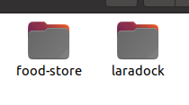

## Install Project guide
Docker
- Clone main project, copy .env.example to .env
- Clone laradock from https://laradock.io in same parent folder

- Go to laradock folder and copy .env.example to .env
- Open .env and set
  - APP_CODE_PATH_HOST=/path-to-main-project
  - PHP_VERSION=8.1
  - APACHE_DOCUMENT_ROOT=/var/www/public
  - MYSQL_DATABASE=(your database's name)
  - MYSQL_USER=(your database's user)
  - MYSQL_PASSWORD=(your database's password)
- Save
- Run docker-compose up -d mysql apache phpmyadmin workspace and wait till finish
- Go back to main project and edit .env
  - DB_HOST=mysql
  - DB_DATABASE=(same as above)
  - DB_USERNAME=(same as above)
  - DB_PASSWORD=(same as above)
  - BROADCAST_DRIVER=pusher
  - PUSHER_APP_ID=1424811
  - PUSHER_APP_KEY=26af0bf4797465adc5fe
  - PUSHER_APP_SECRET=e03c315cb380ce838794
  - PUSHER_APP_CLUSTER=ap1
- Run docker exec -it laradock-php-fpm-1 /bin/bash to access docker container
- Run php artisan migrate for migration
- Run php artisan db:seed for data test
- access localhost/login to website login
- access localhost:8081 to phpmyadmin login
